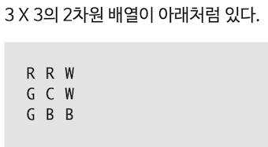

## 코드스쿼드 코딩테스트_루빅스 큐브 구현하기

#### 1단계 : 단어 밀어내기 구현하기

#### 2단계 : 평면 큐브 구현하기
 * 조건
  1. 처음 시작하면 초기 상태를 출력한다.
  2. 간단한 프롬프트 (CLI에서 키보드 입력받기 전에 표시해주는 간단한 글자들 - 예: CUBE> )를 표시해 준다.
  3. 한 번에 여러 문자를 입력받은 경우 순서대로 처리해서 매 과정을 화면에 출력한다.

 * 요구사항
  1. 너무 크지 않은 함수 단위로 구현하려고 노력할 것
  2. 전역변수의 사용을 자제할 것
  3. 객체와 배열을 적절히 활용할 것

 * 프로그램 구현 순서(html, javascript 사용)
  1. 초기 배열을 구성한다. (javadcript 3X3 배열 구성)
  2. 초기 상태를 출력한다.  
    
  3. 상태 변경 동작을 입력 받는다.(console 명령 구현(조건)과 함께 html 구현하는 김에 button 구성도 하고 싶다.)
  4. 입력 받은 조건을 구동한다
   * 각 명령어 별로 줄 이동이 되게끔 함수를 구성.(배열 간 이동이 고민이다.)
   * 명령어 별 설명
   U  가장 윗줄을 왼쪽으로 한 칸 밀기 RRW -> RWR
   U' 가장 윗줄을 오른쪽으로 한 칸 밀기 RRW -> WRR  
   R  가장 오른쪽 줄을 위로 한 칸 밀기 WWB -> WBW  
   R' 가장 오른쪽 줄을 아래로 한 칸 밀기 WWB -> BWW  
   L  가장 왼쪽 줄을 아래로 한 칸 밀기 RGG -> GRG (L의 경우 R과 방향이 반대임을 주의한다.)  
   L' 가장 왼쪽 줄을 위로 한 칸 밀기 RGG -> GGR  
   B  가장 아랫줄을 오른쪽으로 한 칸 밀기 GBB -> BGB (B의 경우도 U와 방향이 반대임을 주의한다.)  
   B' 가장 아랫줄을 왼쪽으로 한 칸 밀기 GBB -> BBG  
   Q  Bye~를 출력하고 프로그램을 종료한다.
  5. 변동된 조건을 출력한다. (html 에 text 형태 및 console 모두 뜨도록 하자.)

#### 3단계 : 루빅스 큐브 구현하기

